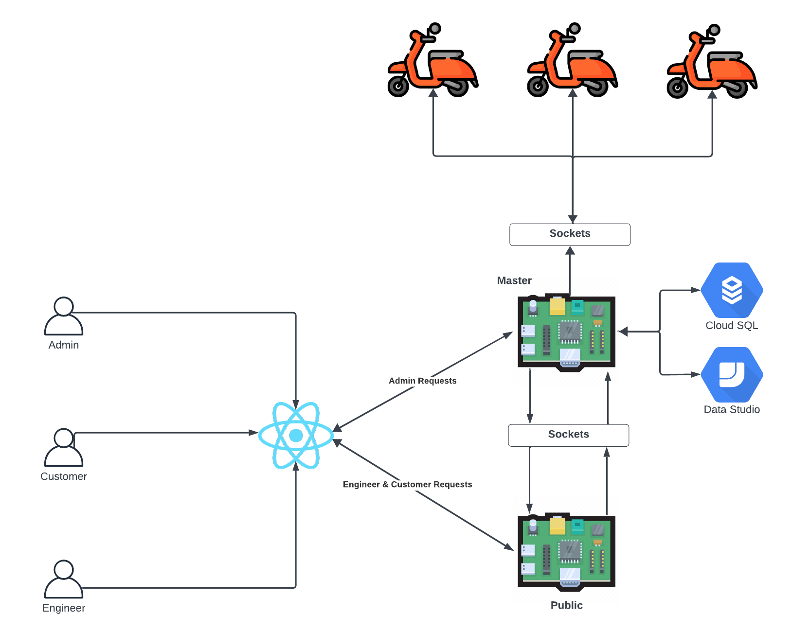

<!-- Improved compatibility of back to top link: See: https://github.com/othneildrew/Best-README-Template/pull/73 -->

<a name="readme-top"></a>

<!--
*** Thanks for checking out the Best-README-Template. If you have a suggestion
*** that would make this better, please fork the repo and create a pull request
*** or simply open an issue with the tag "enhancement".
*** Don't forget to give the project a star!
*** Thanks again! Now go create something AMAZING! :D
-->

<!-- PROJECT SHIELDS -->
<!--
*** I'm using markdown "reference style" links for readability.
*** Reference links are enclosed in brackets [x] instead of parentheses ( ).
*** See the bottom of this document for the declaration of the reference variables
*** for contributors-url, forks-url, etc. This is an optional, concise syntax you may use.
*** https://www.markdownguide.org/basic-syntax/#reference-style-links
-->

[![Contributors][contributors-shield]][contributors-url]
[![Forks][forks-shield]][forks-url]
[![Stargazers][stars-shield]][stars-url]
[![Issues][issues-shield]][issues-url] [![LinkedIn][linkedin-shield]][linkedin-url] <!-- PROJECT LOGO --> <br /> <div align="center"> <a href="https://github.com/LukeMacdonald/scooter-share">  </a> <h3 align="center">Scooter Share</h3> <p align="center"> Scooter Share is an easy-to-use web application developed to make online scooter reservations more efficient. Through an easy-to-use map interface, users can quickly find and reserve scooters that are available in their area. <br />
<a href="https://github.com/LukeMacdonald/scooter-share"><strong>Explore the docs »</strong></a>
<br />
<br />
<a href="https://github.com/LukeMacdonald/scooter-share">View Demo</a>
·
<a href="https://github.com/LukeMacdonald/scooter-share/issues">Report Bug</a>
·
<a href="https://github.com/LukeMacdonald/scooter-share/issues">Request Feature</a>

  </p>
</div>

<!-- TABLE OF CONTENTS -->
<details>
  <summary>Table of Contents</summary>
  <ol>
    <li>
      <a href="#about-the-project">About The Project</a>
      <ul>
        <li><a href="#built-with">Built With</a></li>
      </ul>
    </li>
    <li>
      <a href="#getting-started">Getting Started</a>
      <ul>
        <li><a href="#system-architecture">System Architecture</a></li>
        <li><a href="#prerequisites">Prerequisites</a></li>
        <li><a href="#installation">Installation</a></li>
      </ul>
    </li>
    <li><a href="#roadmap">Roadmap</a></li>
    <li><a href="#contributing">Contributing</a></li>
    <li><a href="#contact">Contact</a></li>
  </ol>
</details>

<!-- ABOUT THE PROJECT -->

## About The Project

Scooter Share is a user-friendly web application designed to streamline the process of booking scooters online!

Users can easily locate and reserve available scooters in their vicinity through an intuitive map interface. The platform provides real-time information on scooter availability, battery status, and pricing, allowing users to make informed decisions.


<p align="right">(<a href="#readme-top">back to top</a>)</p>

### Built With

- [![Python][Python.com]][Python-url]
- [![Flask][Flask.com]][Flask-url]
- [![React][React.js]][React-url]
- [![TailwindCSS][TailwindCSS.com]][TailwindCSS-url]
- [![RaspberryPi][RaspberryPi.com]][RaspberryPi-url]
- [![GoogleCloud][GoogleCloud.com]][GoogleCloud-url]

<p align="right">(<a href="#readme-top">back to top</a>)</p>

<!-- GETTING STARTED -->

## Getting Started

### System Architecture



All users using the web application will access it through the same react web application.

- The requests made by users are routed based on their roles.

Customer and Engineer requests are first routed to the public flask API which runs externally from application which communicates with the database and scooters.

Admin requests are made directly to the master flask application which has direct communication with the database and scooters.

- Admin's are only allowed to access their dashboard by directly logging on with the same device that the master flask API is running on. IP address validation checking is used to ensure this.

The master application does all its communication between the public API and the scooters using sockets.

### Prerequisites

- RaspberryPi with GPS module attached (1 per scooter)
- `python` and `pip` both installed on all devices running flask api's and socket endpoints
- `npm` installed on device running `react` frontend.

### Installation

1. Clone the repo
   ```sh
   git clone https://github.com/LukeMacdonald/scooter-share.git
   ```
2. Install Frontend packages
   ```sh
   cd client
   npm install
   ```
3. Install backend packages
   ```sh
   cd server
   pip install -r requirements.txt
   ```
4. Running Backend that controls requests from customers and engineers
   ```sh
   cd server/public
   python app.py
   ```
5. Running Backend that controls requests from admins and the socket server for requests for public backend.
   ```sh
   cd server/master
   python main.py
   ```
6. Running the socket server which runs on each of the RaspberryPi's attached to scooters.
`sh
    cd server/scooter
    python scooter.py
    `
<p align="right">(<a href="#readme-top">back to top</a>)</p>

<p align="right">(<a href="#readme-top">back to top</a>)</p>

<!-- ROADMAP -->

## Roadmap

- [x] Book a Scooter Reservation
  - [x] Limit bookings so they can only be made 2 hours in advanced.
  - [x] Once scooter is booked customer can using Google Maps API to get directions to its location.
- [x] Unlock and Lock Booked Scooter using QR Codes
  - [x] Unlock and Lock times are used to calculate cost of customers booking.
  - [x] All communication made between scooter and master API is done through sockets.
  - [ ] Customers have the option of unlocking scooter with face recogntion instead of QR codes.
- [x] Manage Scooter Repair Requests
  - [x] Require Admins to Approve Repair Requests made by Customers Before they are sent to Engineers.
  - [x] Repair requests are mass emailed to all engineers once approved by admin
  - [x] Details about scooters awaiting repairs are displayed on Engineer Dashboard.
  - [x] Engineers can mark scooters as repaired and they are once again available for booking.
- [x] Admins can view all web application data and statistics including:
  - [x] Scooter and Customer Details
  - [ ] Weekly and Monthly Scooter Usage Bookings
  - [ ] Entire Scooter Booking History
- [x] Realtime gps tracking of scooters using gps module attached to RaspberryPi.

See the [open issues](https://github.com/LukeMacdonald/scooter-share/issues) for a full list of proposed features (and known issues).

<p align="right">(<a href="#readme-top">back to top</a>)</p>

<!-- CONTRIBUTING -->

## Contributing

Contributions are what make the open source community such an amazing place to learn, inspire, and create. Any contributions you make are **greatly appreciated**.

If you have a suggestion that would make this better, please fork the repo and create a pull request. You can also simply open an issue with the tag "enhancement".
Don't forget to give the project a star! Thanks again!

1. Fork the Project
2. Create your Feature Branch (`git checkout -b feature/AmazingFeature`)
3. Commit your Changes (`git commit -m 'Add some AmazingFeature'`)
4. Push to the Branch (`git push origin feature/AmazingFeature`)
5. Open a Pull Request

<p align="right">(<a href="#readme-top">back to top</a>)</p>

## Contact

Luke Macdonald - lukemacdonald21@gmail.com.com

Project Link: [https://github.com/LukeMacdonald/scooter-share](https://github.com/LukeMacdonald/scooter-share)

<p align="right">(<a href="#readme-top">back to top</a>)</p>

<!-- ACKNOWLEDGMENTS -->

<!-- MARKDOWN LINKS & IMAGES -->
<!-- https://www.markdownguide.org/basic-syntax/#reference-style-links -->

[contributors-shield]: https://img.shields.io/github/contributors/LukeMacdonald/scooter-share.svg?style=for-the-badge
[contributors-url]: https://github.com/LukeMacdonald/scooter-share/graphs/contributors
[forks-shield]: https://img.shields.io/github/forks/LukeMacdonald/scooter-share.svg?style=for-the-badge
[forks-url]: https://github.com/LukeMacdonald/scooter-share/network/members
[stars-shield]: https://img.shields.io/github/stars/LukeMacdonald/scooter-share.svg?style=for-the-badge
[stars-url]: https://github.com/LukeMacdonald/scooter-share/stargazers
[issues-shield]: https://img.shields.io/github/issues/LukeMacdonald/scooter-share.svg?style=for-the-badge
[issues-url]: https://github.com/LukeMacdonald/scooter-share/issues
[linkedin-shield]: https://img.shields.io/badge/-LinkedIn-black.svg?style=for-the-badge&logo=linkedin&colorB=555
[linkedin-url]: https://linkedin.com/in/luke-macdonald-292a4a208
[product-screenshot]: images/screenshot.png
[React.js]: https://img.shields.io/badge/React-20232A?style=for-the-badge&logo=react&logoColor=61DAFB
[React-url]: https://reactjs.org/
[RaspberryPi.com]: https://img.shields.io/badge/-RaspberryPi-C51A4A?style=for-the-badge&logo=Raspberry-Pi
[RaspberryPi-url]: https://www.raspberrypi.org/
[Flask.com]: https://img.shields.io/badge/flask-%23000.svg?style=for-the-badge&logo=flask&logoColor=white
[Flask-url]: https://flask.palletsprojects.com/en/3.0.x/
[Python.com]: https://img.shields.io/badge/python-3670A0?style=for-the-badge&logo=python&logoColor=ffdd54
[Python-url]: https://www.python.org/
[TailwindCSS.com]: https://img.shields.io/badge/tailwindcss-%2338B2AC.svg?style=for-the-badge&logo=tailwind-css&logoColor=white
[TailwindCSS-url]: https://tailwindcss.com/
[GoogleCloud.com]: https://img.shields.io/badge/GoogleCloud-%234285F4.svg?style=for-the-badge&logo=google-cloud&logoColor=white
[GoogleCloud-url]: https://cloud.google.com/free/?utm_source=google&utm_medium=cpc&utm_campaign=japac-AU-all-en-dr-BKWS-all-core-trial-EXA-dr-1605216&utm_content=text-ad-none-none-DEV_c-CRE_602320994293-ADGP_Hybrid+%7C+BKWS+-+EXA+%7C+Txt+~+GCP_General_core+brand_main-KWID_43700071544383182-aud-970366092687:kwd-6458750523&userloc_9071462-network_g&utm_term=KW_google%20cloud&gad_source=1&gclid=Cj0KCQiAqsitBhDlARIsAGMR1RgIrjd_AU_9uqZwnZ44SCQ5nvt86XKd-cud0p-u3DQ4R3v7FSiPoDQaAsnFEALw_wcB&gclsrc=aw.ds
